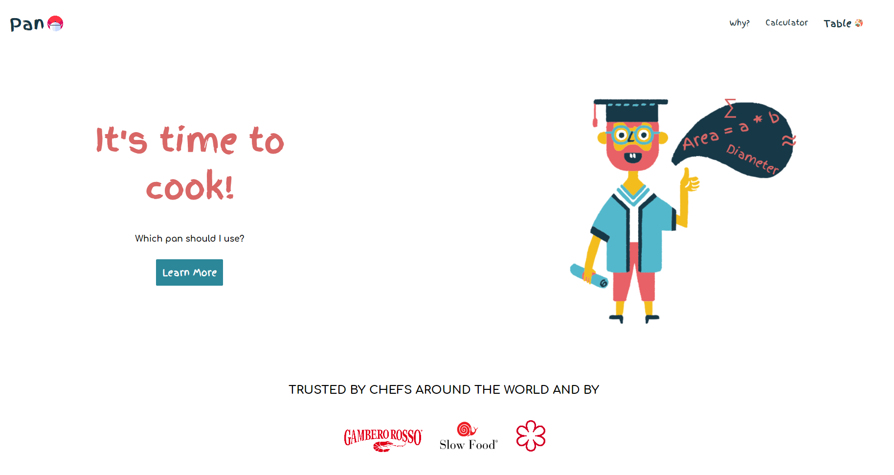

# Overview

### The challenge

Users should be able to: 

-Convert the ingredients given by a recipe that indicates the size of the pan, with the size of the user's pan.

### Screenshot

### Links

- Live Site URL: [Add live site URL here](https://your-live-site-url.com)

## My process

### Built with

- [React](https://reactjs.org/) - JS library
- [Styled Components](https://styled-components.com/) - For styles

### What I learned
My focus of this project was on practising React.
I tried to recreate the website Table with Styled Component instead of using CSS/sass

### Continued development

I understood that using react you must organize all the workflow even if the project is simple like this one and do not underestimate small details, even the smallest and most insignificant can become huge if you have not made the right work plan.

## Author

- Website - [Diego Massarini](https://diego-slicecode.dev/)
- Twitter - [@slicecodediego](https://twitter.com/slicecodediego)

